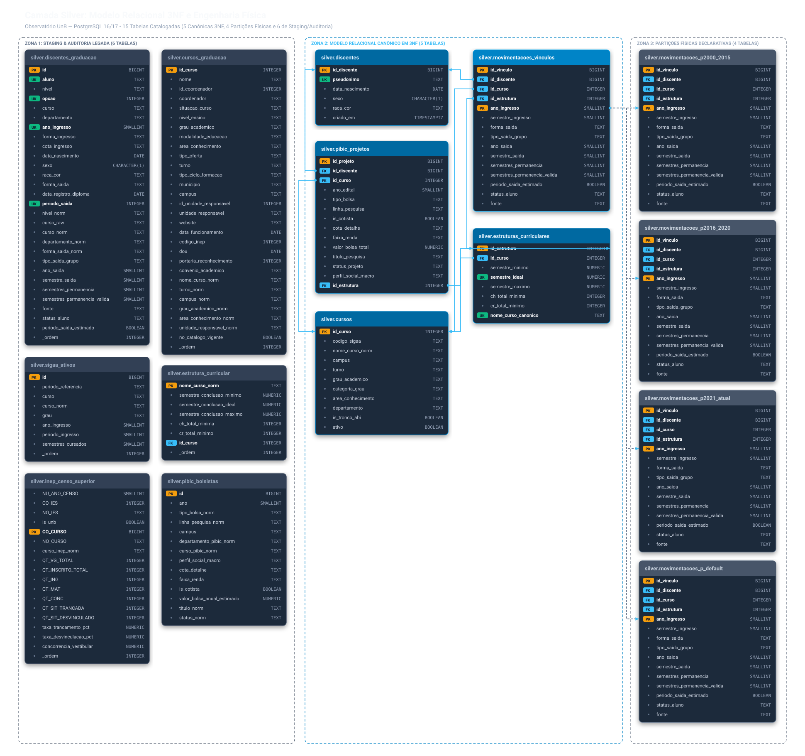
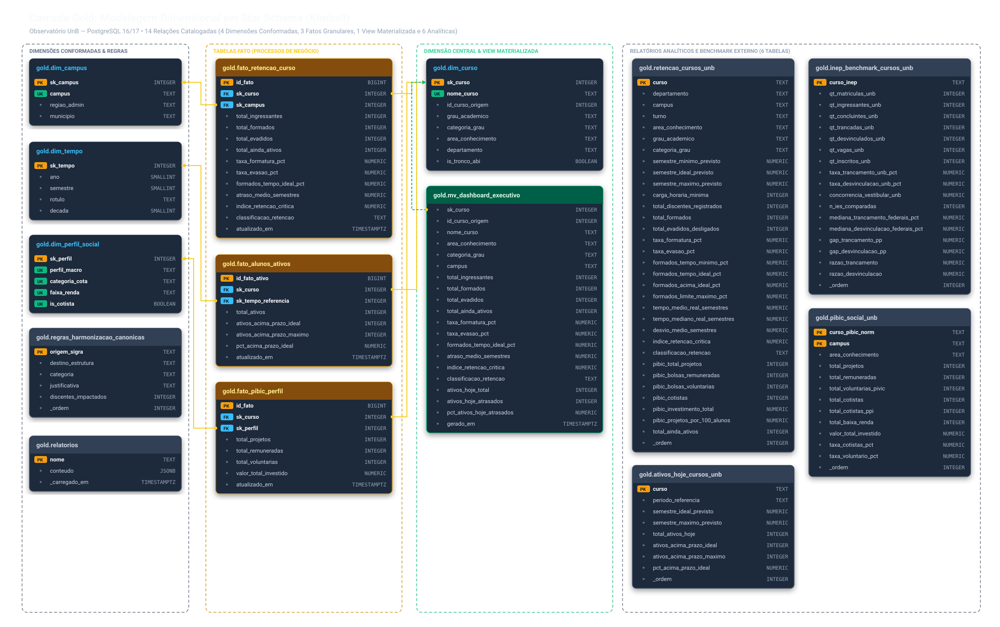

# Diagrama Entidade-Relacionamento (DER) Conceitual, Lógico e Físico

> **Universidade de Brasília (UnB)**  
> **Disciplina**: Banco de Dados 2  
> **Projeto**: Observatório de Retenção, Formatura e Evasão da Graduação  
> **Notação**: Peter Chen (Conceitual) e Notação de Engenharia de Informação / Crow's Foot (Lógico)  
> **SGBD Alvo**: PostgreSQL 17 (Supabase) / PostgreSQL 16 (Docker)

---

## 1. Visão Geral da Modelagem e Arquitetura ANSI/SPARC

O projeto adota a clássica **Arquitetura de Três Níveis ANSI/SPARC**, distinguindo com clareza o modelo conceitual, a modelagem lógica canônica e a implementação física no SGBD:

```
+-------------------------------------------------------------------------------+
|                       1. NÍVEL CONCEITUAL (PETER CHEN)                        |
|   Regras de negócio puras, entidades fortes/fracas e cardinalidades (min, max)|
+---------------------------------------+---------------------------------------+
                                        | (Normalização Clássica de Codd / 3NF)
                                        v
+-------------------------------------------------------------------------------+
|                     2. NÍVEL LÓGICO (CROW'S FOOT / KIMBALL)                   |
|   - Camada Silver: 5 relações canônicas em 3ª Forma Normal                    |
|   - Camada Gold: Modelo Dimensional Star Schema (Dimensões Conformadas/Fatos) |
+---------------------------------------+---------------------------------------+
                                        | (Engenharia Física e Otimização SGBD)
                                        v
+-------------------------------------------------------------------------------+
|                       3. NÍVEL FÍSICO (CATÁLOGO POSTGRESQL)                   |
|   - Particionamento horizontal declarativo (4 partições em disco)             |
|   - Métodos de acesso especializados (B-Tree, GIN Trigram, HNSW pgvector)    |
|   - Tabelas de carga, staging, governança e auditoria analítica               |
+-------------------------------------------------------------------------------+
```

---

## 2. Modelo Conceitual (DER Conceitual - Notação Peter Chen)

### 2.1 Especificação das Entidades e Papéis Semânticos
* **DISCENTE**: Entidade forte representando a pessoa física matriculada na Universidade de Brasília.
* **CURSO**: Entidade forte representando a habilitação acadêmica vinculada a uma unidade e campus.
* **ESTRUTURA_CURRICULAR**: Entidade que define a grade pedagógica, prazos e cargas horárias regulamentadas pelo CEPE.
* **MOVIMENTACAO_VINCULO**: Entidade fraca por histórico/identificação que registra o ciclo de vida do discente no curso.
* **PROJETO_PIBIC**: Entidade de pesquisa acadêmica executada pelo discente e alocada ao curso.

### 2.2 Diagrama Conceitual com Cardinalidades Formais $(min, max)$

```
   +--------------------+                         +-------------------------+
   |      DISCENTE      |                         |          CURSO          |
   | (id_discente, hash)|                         | (id_curso, nome, campus)|
   +---------+----------+                         +------------+------------+
             |                                                 |
             | (1, 1)                                          | (1, 1)
             |                                                 |
             v                                                 v
    /=================\                               /=================\
   <  VINCULADO_A_CUR  >                             <  OFERTA_ESTRUT    >
    \=================/                               \=================/
             ^                                                 ^
             | (0, N)                                          | (1, N)
             |                                                 |
             +--------------------+   +------------------------+
                                  |   |
                                  v   v
                   +----------------------------------+
                   |       ESTRUTURA_CURRICULAR       |
                   | (id_estrutura, semestres, ch)    |
                   +-----------------+----------------+
                                     |
                                     | (1, 1)
                                     v
                            /=================\
                           < REGULA_VINCULO    >
                            \=================/
                                     ^
                                     | (0, N)
                                     |
   +---------------------------------+--------------------------------------+
   |                                                                        |
   | (1, 1)                                                                 | (1, 1)
   v                                                                        v
+------------------------------------+                    +-----------------+------------------+
|       MOVIMENTACAO_VINCULO         |                    |          PROJETO_PIBIC             |
| (id_movimentacao, ano_ingresso,    |                    | (id_projeto, edital_ano, titulo,   |
|  situacao_vinculo, data_ocorrencia)|                    |  bolsa_concedida)                  |
+------------------------------------+                    +-----------------+------------------+
   ^                                                                        ^
   | (0, N)                                                                 | (0, N)
   +---------------------------+                      +---------------------+
                               |                      |
                               | (1, 1)               | (1, 1)
                      /=================\    /=================\
                     <  EXECUTA_PESQ     >  <  ABRIGA_PESQ     >
                      \=================/    \=================/
                               ^                      ^
                               |                      |
                      [ DISCENTE ]               [ CURSO ]
```

---

## 3. DER Lógico Relacional: Camada Silver (3ª Forma Normal)

Este modelo lógico define o contrato formal das **5 relações canônicas em 3NF**, eliminando redundâncias e assegurando integridade referencial estrita.



<details>
<summary><b>Clique para expandir a representação estrutural em texto (ASCII)</b></summary>

```
+-------------------------------------------------------------+
|                       silver.discentes                      |
+-------------------------------------------------------------+
| PK  id_discente             BIGINT GENERATED ALWAYS         |
| UK  pseudonimo              TEXT NOT NULL                   |
|     data_nascimento         DATE                            |
|     sexo                    CHAR(1) (CHECK in 'F', 'M')     |
|     raca_cor                TEXT                            |
|     criado_em               TIMESTAMPTZ DEFAULT now()       |
+-------------------------------------------------------------+
       ||                           ||
       || (1)                       || (1)
       ||                           ||
       ||                           ||
       ||                           ||
       || (0..N)                    || (0..N) [LGPD: id_discente nulo na carga]
       }o                           }o
+------v------------------------------------------------------+       +-------------------------------------------------------------+
|             silver.movimentacoes_vinculos (PARTITIONED)     |       |                        silver.cursos                        |
+-------------------------------------------------------------+       +-------------------------------------------------------------+
| PK  id_vinculo              BIGINT GENERATED ALWAYS         |       | PK  id_curso                INTEGER NOT NULL                |
| PK  ano_ingresso            SMALLINT NOT NULL (Part. Key)   |       |     codigo_sigaa            TEXT                            |
| FK  id_discente             BIGINT NOT NULL ----------------+       |     nome_curso_norm         TEXT NOT NULL [GIN Trigram]     |
| FK  id_curso                INTEGER NOT NULL ---------------+------>|     campus                  TEXT NOT NULL                   |
| FK  id_estrutura            INTEGER NOT NULL ---------------+       |     turno                   TEXT NOT NULL (CHECK 7 valores) |
|     semestre_ingresso       SMALLINT (CHECK 0, 1, 2)        |   (1) |     grau_academico          TEXT NOT NULL                   |
|     forma_saida             TEXT                            |       |     categoria_grau          TEXT NOT NULL (BACH/LIC/MISTO)  |
|     tipo_saida_grupo        TEXT NOT NULL (CHECK GRUPO)     |       |     area_conhecimento       TEXT NOT NULL                   |
|     ano_saida               SMALLINT                        |       |     departamento            TEXT                            |
|     semestre_saida          SMALLINT (CHECK 0, 1, 2)        |       |     is_tronco_abi           BOOLEAN NOT NULL DEFAULT false  |
|     semestres_permanencia   SMALLINT                        |       |     ativo                   BOOLEAN NOT NULL DEFAULT true   |
|     semestres_permanencia_v SMALLINT (CHECK 1..35)          |       +------------------------------+------------------------------+
|     periodo_saida_estimado  BOOLEAN NOT NULL DEFAULT false  |                                      ||
|     status_aluno            TEXT                            |                                      || (1)
|     fonte                   TEXT NOT NULL (SIGRA/SIGAA)     |                                      ||
+-------------------------------------------------------------+                                      || (1..N)
                                                                                                     }|
                                                                      +------------------------------v------------------------------+
                                                                      |                 silver.estruturas_curriculares              |
                                                                      +-------------------------------------------------------------+
                                                                      | PK  id_estrutura            INTEGER GENERATED ALWAYS        |
                                                                      | UK  nome_curso_canonico     TEXT NOT NULL                   |
                                                                      | FK  id_curso                INTEGER NOT NULL (ON DEL RESTR) |
                                                                      |     semestre_minimo         NUMERIC(4,1) NOT NULL (CHECK>0) |
                                                                      |     semestre_ideal          NUMERIC(4,1) NOT NULL (CHECK>=min)
                                                                      |     semestre_maximo         NUMERIC(4,1) NOT NULL           |
                                                                      |     ch_total_minima         INTEGER (CHECK >= 0)            |
                                                                      |     cr_total_minimo         INTEGER (CHECK >= 0)            |
                                                                      +-------------------------------------------------------------+
                                                                      | UK  (id_curso, semestre_ideal)                              |
                                                                      +------------------------------+------------------------------+
                                                                                                     ^
                                                                                                     | (1)
                                                                                                     |
                                                                                                     | (0..N)
                                 +-------------------------------------------------------------+     |
                                 |                    silver.pibic_projetos                    |     |
                                 +-------------------------------------------------------------+     |
                                 | PK  id_projeto              BIGINT GENERATED ALWAYS         |     |
                                 | FK  id_discente             BIGINT (Ref: discentes)         |     |
                                 | FK  id_curso                INTEGER (Ref: cursos)           |     |
                                 | FK  id_estrutura            INTEGER ------------------------+-----+
                                 |     ano_edital              SMALLINT NOT NULL               |
                                 |     tipo_bolsa              TEXT NOT NULL (CHECK REM/VOL/NI)|
                                 |     linha_pesquisa          TEXT                            |
                                 |     is_cotista              BOOLEAN NOT NULL                |
                                 |     cota_detalhe            TEXT                            |
                                 |     faixa_renda             TEXT                            |
                                 |     perfil_social_macro     TEXT                            |
                                 |     valor_bolsa_total       NUMERIC(10,2) NOT NULL (>= 0)   |
                                 |     titulo_pesquisa         TEXT NOT NULL                   |
                                 |     status_projeto          TEXT                            |
                                 +-------------------------------------------------------------+
```
</details>

---

## 4. Mapeamento Físico: Discriminação Integral do Esquema Silver no PostgreSQL

No catálogo do PostgreSQL (`information_schema.tables` e `pg_class`), o schema `silver` abriga **15 relações físicas**, distribuídas estrategicamente segundo o papel arquitetural:

```
+---------------------------------------------------------------------------------------------------+
|                  DISCRIMINAÇÃO DO CATÁLOGO FÍSICO DO SGBD (POSTGRESQL 16/17)                      |
+--------------------------+----------------------------+-------------------------------------------+
| Tabela no Catálogo Físico| Classificação Arquitetural | Explicação de Engenharia de SGBD          |
+--------------------------+----------------------------+-------------------------------------------+
| `discentes`              | Tabela Canônica 3NF        | Entidade relacional de discentes únicos   |
| `cursos`                 | Tabela Canônica 3NF        | Catálogo canônico indexado com GIN Trigram|
| `estruturas_curriculares`| Tabela Canônica 3NF        | Matrizes curriculares e prazos regulament.|
| `movimentacoes_vinculos` | Tabela Lógica Particionada | Tabela-mãe declarativa (PARTITION BY RANGE)|
| `movimentacoes_p2000_2015`| Partição Física Declarativa| Bucket físico para dados de 2000 a 2015   |
| `movimentacoes_p2016_2020`| Partição Física Declarativa| Bucket físico para coortes maduras        |
| `movimentacoes_p2021_atual`| Partição Física Declarativa| Bucket físico para dados de 2021 a 2035  |
| `movimentacoes_p_default`| Partição Física Declarativa| Bucket físico default para salvaguarda    |
| `pibic_projetos`         | Tabela Canônica 3NF        | Relação normalizada de pesquisas de IC    |
| `cursos_graduacao`       | Staging / Origem           | Carga bruta do catálogo de cursos         |
| `discentes_graduacao`    | Staging / Auditoria        | Carga bruta histórica unificada do SIGRA  |
| `estrutura_curricular`   | Staging / Origem           | Carga bruta de matrizes curriculares      |
| `inep_censo_superior`    | Staging / Benchmark        | Dados brutos do Censo da Educação Superior|
| `pibic_bolsistas`        | Staging / Auditoria        | Relação legada/desnormalizada preservada  |
| `sigaa_ativos`           | Staging / Snapshot         | Extrato mensal bruto de ativos do SIGAA   |
+--------------------------+----------------------------+-------------------------------------------+
```

### 4.1 O Fenômeno das Partições no Visualizador de Esquemas
No padrão declarativo do PostgreSQL, as partições filhas (`movimentacoes_p*`) são armazenadas internamente como tabelas físicas individuais no catálogo `pg_class`, herdando todas as colunas e chaves estrangeiras da tabela-mãe.
* **O comportamento do Supabase/DBeaver**: Ferramentas visuais automatizadas de catálogo renderizam cada partição física como uma caixa independente e traçam as chaves estrangeiras repetidas, gerando uma teia de linhas cruzadas.
* **O rigor acadêmico de BD2**: Em modelagem conceitual e lógica, **particionamento é detalhe de armazenamento físico**, não uma nova entidade de negócio. O DER oficial consolida as partições na entidade única `movimentacoes_vinculos [PARTITIONED]`.

---

## 5. DER Lógico Dimensional: Camada Gold (Star Schema de Kimball)

A camada analítica reestrutura os dados em torno de processos de negócio com dimensões conformadas e tabelas de fatos granulares.



<details>
<summary><b>Clique para expandir a representação estrutural em texto (ASCII)</b></summary>

```
       +---------------------------------------------+
       |               gold.dim_campus               |
       +---------------------------------------------+
       | PK  sk_campus       INTEGER NOT NULL        |
       | UK  campus          TEXT NOT NULL           |
       |     regiao_admin    TEXT NOT NULL           |
       |     municipio       TEXT DEFAULT 'Brasília' |
       +----------------------+----------------------+
                              ||
                              || (1)
                              ||
                              || (0..N)
                              }o
+-----------------------------v-------------------------------+       +---------------------------------------------+
|                  gold.fato_retencao_curso                   |       |                gold.dim_curso               |
+-------------------------------------------------------------+       +---------------------------------------------+
| PK  id_fato                 BIGINT GENERATED ALWAYS         |       | PK  sk_curso        INTEGER NOT NULL        |
| FK  sk_curso                INTEGER NOT NULL ---------------+------>| UK  nome_curso      TEXT NOT NULL           |
| FK  sk_campus               INTEGER NOT NULL                |  (1)  |     id_curso_origem INTEGER                 |
|     total_ingressantes      INTEGER NOT NULL (CHECK >= 5)   |       |     grau_academico  TEXT NOT NULL           |
|     total_formados          INTEGER NOT NULL                |       |     categoria_grau  TEXT NOT NULL           |
|     total_evadidos          INTEGER NOT NULL                |       |     area_conhecimento TEXT NOT NULL         |
|     total_ainda_ativos      INTEGER NOT NULL DEFAULT 0      |       |     departamento    TEXT                    |
|     taxa_formatura_pct      NUMERIC(5,2)                    |       |     is_tronco_abi   BOOLEAN DEFAULT false   |
|     taxa_evasao_pct         NUMERIC(5,2)                    |       +----------------------+----------------------+
|     formados_tempo_ideal_pct NUMERIC(5,2)                   |                              ||
|     atraso_medio_semestres  NUMERIC(5,2)                    |                              || (1)
|     indice_retencao_critica NUMERIC(4,1)                    |                              ||
|     classificacao_retencao  TEXT                            |                              || (0..1)
|     atualizado_em           TIMESTAMPTZ DEFAULT now()       |                              |
+-------------------------------------------------------------+       +----------------------v----------------------+
                                                                      |            gold.fato_alunos_ativos          |
                                                                      +---------------------------------------------+
                                                                      | PK  id_fato_ativo   BIGINT GENERATED ALWAYS |
                                                                      | FK  sk_curso        INTEGER NOT NULL (UK)   |
                                                                      | FK  sk_tempo_referencia INTEGER NOT NULL    |
                                                                      |     total_ativos    INTEGER (CHECK >= 5)    |
                                                                      |     ativos_acima_ideal INTEGER NOT NULL     |
                                                                      |     ativos_acima_maximo INTEGER NOT NULL    |
                                                                      |     pct_acima_ideal NUMERIC(5,2) NOT NULL   |
                                                                      |     atualizado_em   TIMESTAMPTZ DEFAULT now()
                                                                      +----------------------+----------------------+
                                                                                             ||
                                                                                             || (0..N)
                                                                                             ||
                                                                                             || (1)
                                                                      +----------------------v----------------------+
                                                                      |               gold.dim_tempo                |
                                                                      +---------------------------------------------+
                                                                      | PK  sk_tempo        INTEGER NOT NULL (AAAAS)|
                                                                      |     ano             SMALLINT NOT NULL       |
                                                                      |     semestre        SMALLINT (CHECK 1, 2)   |
                                                                      |     rotulo          TEXT NOT NULL ('2024/1')|
                                                                      |     decada          SMALLINT NOT NULL       |
                                                                      +---------------------------------------------+

+-------------------------------------------------------------+       +---------------------------------------------+
|                   gold.fato_pibic_perfil                    |       |           gold.dim_perfil_social            |
+-------------------------------------------------------------+       +---------------------------------------------+
| PK  id_fato                 BIGINT GENERATED ALWAYS         |       | PK  sk_perfil       INTEGER NOT NULL        |
| FK  sk_curso                INTEGER NOT NULL (Ref:dim_curso)|       | UK  (perfil_macro, categoria_cota,          |
| FK  sk_perfil               INTEGER NOT NULL ---------------+------>|      faixa_renda, is_cotista)               |
|     total_projetos          INTEGER NOT NULL (CHECK >= 5)   |  (1)  +---------------------------------------------+
|     total_remuneradas       INTEGER NOT NULL (CHECK >= 0)   |
|     total_voluntarias       INTEGER NOT NULL (CHECK >= 0)   |
|     valor_total_investido   NUMERIC(14,2) NOT NULL (>= 0)   |
|     atualizado_em           TIMESTAMPTZ DEFAULT now()       |
+-------------------------------------------------------------+
```
</details>

---

## 6. Matriz Formal de Integridade Referencial

Esta matriz documenta o comportamento exato de integridade referencial implementado no catálogo PostgreSQL (`information_schema.referential_constraints` e `pg_constraint`):

| Tabela Filha (FK) | Coluna FK | Tabela Pai (PK) | Coluna PK | Cardinalidade | Ação ON DELETE | Ação ON UPDATE | Regra de Negócio |
|:---|:---|:---|:---|:---:|:---:|:---:|:---|
| `silver.movimentacoes_vinculos` | `id_discente` | `silver.discentes` | `id_discente` | $N : 1$ | `RESTRICT` | `NO ACTION` | Impede apagar o discente se houver histórico acadêmico associado. |
| `silver.movimentacoes_vinculos` | `id_curso` | `silver.cursos` | `id_curso` | $N : 1$ | `RESTRICT` | `NO ACTION` | Um curso institucional não pode ser deletado enquanto possuir vínculos. |
| `silver.movimentacoes_vinculos` | `id_estrutura` | `silver.estruturas_curriculares` | `id_estrutura` | $N : 1$ | `NO ACTION` | `NO ACTION` | Vínculos operacionais devem apontar para matriz curricular ativa. |
| `silver.estruturas_curriculares` | `id_curso` | `silver.cursos` | `id_curso` | $N : 1$ | `RESTRICT` | `NO ACTION` | Matrizes curriculares são protegidas contra deleção do curso dono. |
| `silver.estrutura_curricular` | `id_curso` | `silver.cursos_graduacao` | `id_curso` | $N : 1$ | `NO ACTION` | `NO ACTION` | Matriz bruta (staging) referencia o catálogo bruto de cursos. |
| `silver.pibic_projetos` | `id_discente` | `silver.discentes` | `id_discente` | $N : 1$ | `NO ACTION` | `NO ACTION` | Planos de IC vinculados a discente (quando disponível). |
| `silver.pibic_projetos` | `id_curso` | `silver.cursos` | `id_curso` | $N : 1$ | `NO ACTION` | `NO ACTION` | Planos de IC vinculados ao catálogo de cursos. |
| `silver.pibic_projetos` | `id_estrutura` | `silver.estruturas_curriculares` | `id_estrutura` | $N : 1$ | `NO ACTION` | `NO ACTION` | Planos de IC associados à matriz curricular canônica. |
| `gold.fato_retencao_curso` | `sk_curso` | `gold.dim_curso` | `sk_curso` | $N : 1$ | `NO ACTION` | `NO ACTION` | Fato analítica mantém integridade com a dimensão curso conformada. |
| `gold.fato_retencao_curso` | `sk_campus` | `gold.dim_campus` | `sk_campus` | $N : 1$ | `NO ACTION` | `NO ACTION` | Todo indicador de retenção mapeia para campus auditável. |
| `gold.fato_alunos_ativos` | `sk_curso` | `gold.dim_curso` | `sk_curso` | $1 : 1$ | `NO ACTION` | `NO ACTION` | Snapshot presente vincula-se unicamente ao curso analisado. |
| `gold.fato_alunos_ativos` | `sk_tempo_referencia` | `gold.dim_tempo` | `sk_tempo` | $N : 1$ | `NO ACTION` | `NO ACTION` | Dimensão temporal garante alinhamento do semestre vigente. |
| `gold.fato_pibic_perfil` | `sk_curso` | `gold.dim_curso` | `sk_curso` | $N : 1$ | `NO ACTION` | `NO ACTION` | Fato de IC vincula-se à dimensão curso conformada. |
| `gold.fato_pibic_perfil` | `sk_perfil` | `gold.dim_perfil_social` | `sk_perfil` | $N : 1$ | `NO ACTION` | `NO ACTION` | Fato de IC vincula-se à dimensão demográfica de perfil social. |

---

## 7. Conformidade com LGPD e k-Anonimato no Modelo Lógico

No nível do modelo lógico e do catálogo de restrições do SGBD:
1. **Pseudonimização Unidirecional**: A tabela `silver.discentes` não armazena nomes civis, CPFs ou matrículas em claro. A chave candidata de negócio é `pseudonimo TEXT UNIQUE`, gerada via hash criptográfico pelo sistema acadêmico sob princípio do privilégio mínimo.
2. **Minimização de Dados em IC**: A tabela `silver.pibic_projetos` não armazena identificação individual dos estudantes (`id_discente` é nulo em conformidade com a migração `0010_pibic.sql`), preservando o sigilo socioeconômico.
3. **Blindagem Declarativa de k-Anonimato ($k \ge 5$)**: As tabelas `gold.fato_retencao_curso`, `gold.fato_alunos_ativos` e `gold.fato_pibic_perfil` possuem a constraint declarativa de domínio:
   ```sql
   CHECK (total_ingressantes >= 5)  -- fato_retencao_curso
   CHECK (total_ativos >= 5)         -- fato_alunos_ativos
   CHECK (total_projetos >= 5)       -- fato_pibic_perfil
   ```
   Caso uma turma ou recorte demográfico possua menos de 5 discentes na agregação, o motor relacional aborta o comando `INSERT`/`UPDATE` via violação de integridade, impedindo inferência estatística individual e reidentificação de estudantes.

